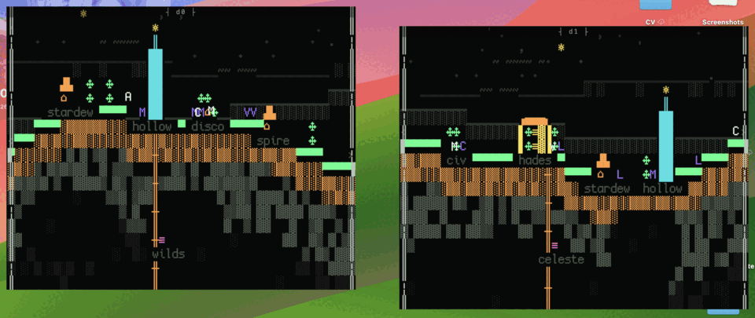
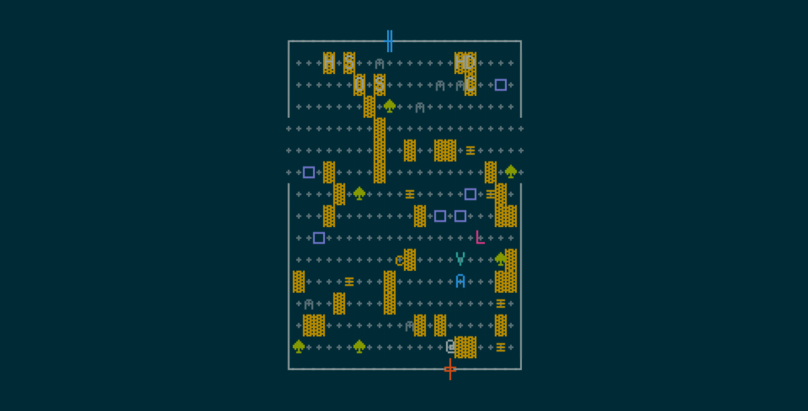
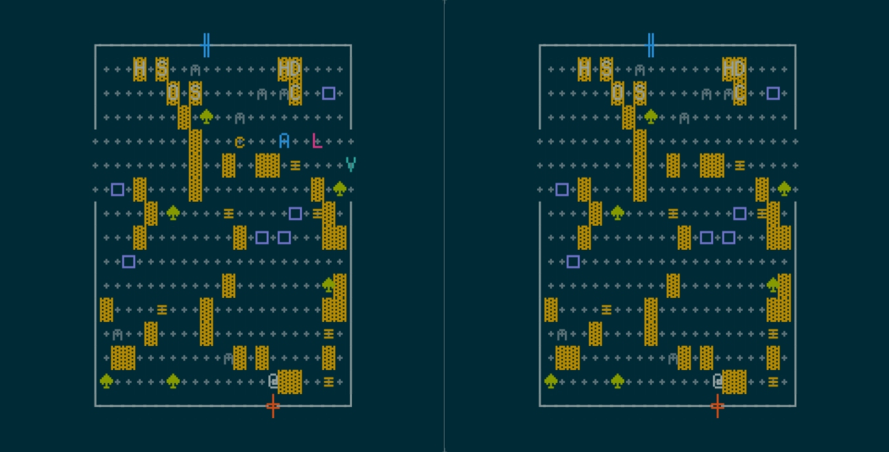

# Lokilibrary

> A memory palace for your Steam library — a terminal-aesthetic pixel world
> where a small society of AI beings lives among your games.



*Two OS windows drift together, snap, the ground knits — and a being walks
out of one window into the other. Each window is a wing of your library.*

Your library becomes an inhabitable place: a procedurally generated hall of
glyph-built shelves, where every book is a game you own and a cohort of
semi-autonomous agents wanders, remembers what it has seen, reflects on it,
and slowly changes the world — notes appear, paths wear in, things get
rearranged overnight. It runs as a normal window, as a live wallpaper behind
your desktop icons, and doubles as a launcher.

The renderer is pixel-art-that-reads-as-terminal: sprites built from
box-drawing characters, block elements, and unicode glyphs (Cozette 6×13),
themeable to editor colour schemes. The agents are the
[generative-agents](https://arxiv.org/abs/2304.03442) pattern in miniature —
a local SQLite memory stream, spatially-bounded perception, and a tiered
router so LLM calls only fire when something is actually worth thinking
about.

**Free and open source (MIT). Bring your own API keys.** No accounts, no
telemetry, no price tag.

> **Status:** working, mid-consolidation. The core loop — generated palace,
> living cohort, themes, multi-pane, wallpaper mode — runs today on macOS and
> Windows; snapping terminals are verified on macOS (a Windows pass is
> pending). Rough edges are tracked in [`TODO-USER.md`](TODO-USER.md); the
> current state of every subsystem lives in [`STATE.md`](STATE.md).

## Quick start — no keys, ~2 minutes

```sh
git clone https://github.com/demonty3/Lokilibrary.git
cd Lokilibrary
npm install
npm run dev        # → http://localhost:5183
```

That's a full palace with a sample library: the room generates
deterministically (wave-function collapse over a seeded PRNG), and the agent
cohort wanders on its LLM-free behaviour tier. No keys needed to see it
alive.



## The full palace — your library, thinking agents, ~10 minutes

The Cloudflare Worker is the backend: it holds your keys, talks to Steam and
Anthropic, and is the only thing the frontend ever calls. Run it locally:

```sh
cp worker/.dev.vars.example worker/.dev.vars
# then edit worker/.dev.vars:
#   ANTHROPIC_API_KEY  — the agents' minds        (console.anthropic.com)
#   STEAM_WEB_API_KEY  — your library             (steamcommunity.com/dev/apikey)
#   SESSION_SECRET     — any long random string   (openssl rand -base64 48)

npm run worker     # second terminal, alongside npm run dev
```

Sign in with Steam in the app and the palace regenerates from *your*
library — shelf placement, districts, and the agents' small talk all derive
from what you actually play. `worker/.dev.vars.example` documents every
other (optional) key.

**What it costs you:** almost all simulation is the free tier-0 behaviour
tree. LLM calls fire only on perception events (Claude Haiku) and on
rate-limited reflection (Claude Sonnet, at most hourly per agent). The
default configuration targets roughly **≤ $1/month** on your Anthropic key,
and a telemetry overlay (``Ctrl+` ``) shows every call it makes.

## Desktop app + wallpaper mode

The Electron wrapper adds Steamworks auth, launching games directly, a tray
toggle, and **wallpaper mode** — the palace rendered behind your desktop
icons (Progman reparenting on Win11, desktop-level `NSWindow` on macOS),
with a three-tier throttle so it sips power when you're not looking and a
peek hotkey (`Ctrl+Alt+L`).

```sh
cd desktop
npm install
npm run dev        # expects npm run dev + npm run worker running
```

One-time Steamworks SDK setup (and the Windows/WSL gotchas):
[`desktop/README.md`](desktop/README.md).

## Snapping terminals — worlds that join

The demo at the top of this page. `LOKILIBRARY_TERMINALS=N` boots N
frameless terminal windows instead of the palace — each one holds a wing of
your library as a side-on living land, with its own beings. The windows are
real OS windows, and the magic is in how they compose:

- **Drag two windows side by side** and they snap edge-to-edge. The walls
  open, the ground lines up into one continuous terrain (both windows derive
  the same seam from a shared seed — no negotiation), and a knit sweep runs
  the seam to stitch it shut.
- **Beings cross between your windows.** They notice the neighbouring land,
  drift toward a populated join, and walk out of one window into the other —
  carrying their speed, direction, and intent with them. Crossings are
  written into their memory stream.
- **Chains work**: three or more windows join A–B–C, with the middle window
  ramping both edges. Drag a window away and the joins close cleanly.
- **The desk persists.** Quit and relaunch — your windows come back where
  you left them, already joined. The tray's *New terminal* opens the next
  unused wing (up to six).

```sh
npm run dev                          # terminal 1 — the renderer
cd desktop && LOKILIBRARY_TERMINALS=2 npm run dev   # terminal 2
# (PowerShell: $env:LOKILIBRARY_TERMINALS=2; npm run dev)
```

Then drag the windows together by their `┤ wing ├` glyph strip.
`scripts/e2e/join-demo.sh` reproduces the animated capture above
end-to-end (macOS).

## Controls

| Key | Action |
|---|---|
| `WASD` / arrows | walk; `E` interacts (shelves launch the game) |
| `[` / `]` | zoom the scale ladder (cell → district → island → …) |
| `\|` | split the focused pane — a second wing with its own world; agents walk between panes through seams |
| `\` | study arrangement (preset multi-pane layout) |
| `Tab` | cycle pane focus |
| `R` | cycle the focused pane through your library's wings |
| ``Ctrl+` `` | agent telemetry overlay (every LLM call, live) |
| `Ctrl+U` | lore upload (desktop app) — drop your worldbuilding notes and the palace re-tunes its palette and voice to them |



## Themes

Solarized Dark (default) · Gruvbox Dark · Catppuccin Mocha · Tokyo Night ·
IBM 3270 · Phosphor. One palette per scene, always — themes are defined as
single JSON files in [`src/themes/`](src/themes/), and adding one is a PR
we'd like to see.

## How it works

- **`src/procedural/`** — deterministic world generation: Mulberry32 PRNG,
  FNV-1a profile seeding, a hand-rolled WFC solver. Same library → same
  palace, always. (`Math.random()` is banned in this directory.)
- **`src/agents/`** — the cohort: behaviour trees for the free tier,
  spatially-bounded perception, a SQLite (+ sqlite-vec + FTS5) memory
  stream per world, Smallville-style importance-triggered reflection that
  produces plans the agents actually execute.
- **`src/render/`** — PixiJS v8 drawing glyphs from a baked Cozette atlas;
  sub-cell movement, fades and glows — a sprite engine pretending to be a
  terminal, on purpose.
- **`worker/`** — the single AI orchestration surface (Cloudflare Worker).
  All keys live here; the frontend and the Electron renderer never hold
  one.
- **`desktop/`** — Electron + steamworks.js + the wallpaper machinery.

Long-form: [`SPEC.md`](SPEC.md) is the consolidated spec,
[`docs/pivot/DESIGN.md`](docs/pivot/DESIGN.md) the design rationale,
[`docs/INDEX.md`](docs/INDEX.md) the map of which document is authoritative
for what.

## Development

```sh
npm run typecheck            # strict TS, frontend + worker
npx tsx scripts/smoke-7d2-walk.mts   # one of the headless smoke suites (scripts/smoke-*.mts)
bash scripts/e2e/run.sh      # deterministic e2e harness: prod build + headless Chrome
```

Dev iteration on the agents without burning API credit: set
`LLM_PROVIDER=local` in `worker/.dev.vars` and point it at Ollama
(`worker/.dev.vars.example` has the block). Local models are a dev tool —
the shipped default stays a frontier model, because agent dialogue is the
product's magic surface.

## On AI content

The agents' minds are live LLM calls (through *your* key, via the Worker —
never from the browser). Sprites and tiles are generated once at
template-build time, hand-curated, and baked into the repo — nothing is
image-generated at runtime. Per-game artwork is deliberately Steam's own CDN
header art, used as a recognition surface; this project never generates art
*for your games*.

## License

[MIT](LICENSE) © 2026 Harry de Montfort. The Cozette font and the Steamworks
SDK carry their own licenses (`public/fonts/`,
`desktop/STEAMWORKS_SDK_LICENSE.txt`).
