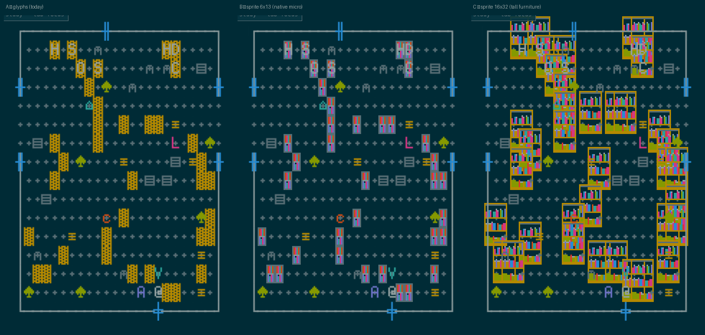

# Sprite fidelity test — one curated bookshelf slot (2026-07-16)

*The Phase-3D question run for real: does a higher-fidelity bookshelf sprite
improve or hurt the read? One slot (`bookshelf`), one theme
(`solarized-dark`), three legs, captured on the deterministic e2e harness.*

## Method

- PixelLab was unavailable (`PIXELLAB_API_KEY` empty in `worker/.dev.vars`),
  so candidates were **hand-authored** — 16×32 + native 6×13 variants, every
  opaque pixel drawn directly from the solarized-dark foreground palette
  (the same set `scripts/lib/quantize.ts` uses). Staged + curated per the
  bake-script discipline; candidates preserved in
  `staging/solarized-dark/bookshelf/`. The medium-collision question doesn't
  depend on which generator drew the pixels; a real PixelLab bake can
  replace the art if the direction is pursued.
- Legs: **A** — glyph baseline (HEAD); **B** — `CURATED_SLOTS += bookshelf`
  with a native 6×13 micro-shelf; **C** — same, plus
  `SLOT_DISPLAY bookshelf {16,32}` (the 3C-β "tall furniture" mode).
  Captures via `scripts/e2e/run.sh` + `drive.mjs shot` (fresh build +
  Chrome per leg). All test edits reverted after capture.

## Verdict

1. **C (16×32 displayed) is confirmed dead** — with *real* art this time,
   not placeholders. WFC places shelves adjacently, so 16px sprites on 6px
   cells overlap and stomp; the beings vanish under furniture; floor,
   marks, and scatter are buried; glance legibility collapses. The 3C-β
   revert was right. This mode only becomes viable if the WFC layer
   reserves multi-tile footprints (option (c) in the `SLOT_DISPLAY`
   comment) — an arc, not a toggle.
2. **B (native 6×13) is the interesting one.** Object-hood genuinely
   improves — shelves read as *furniture with books* rather than texture
   slabs, and spine initials still compose over them. But as-tested it
   loses to baseline on the attention contract: full-accent spine colours
   out-shout the beings (the pink `L` disappears beside pink books), and
   the grey frame surrenders the world's shelf-gold identity.
3. **A (glyphs) still wins today.** Calmer, warmer, the beings own their
   accents.

## The path, if fidelity is pursued

A **tuned 6×13 second pass**: shelf-gold frame (identity), spines
constrained to 2–3 *cool* hues per theme (blue/cyan/violet — reserving
warm accents for beings per `src/themes/roles.ts`), one slot at a time.
At this size a sprite is effectively a **custom glyph** — which converges
with visual-programme item #10 (shelves as spine strokes in glyph
vocabulary). Do #10 first; it buys the same read without opening the
sprite pipeline. Escalate to actual sprites only if #10's glyph version
proves insufficient on screen.
